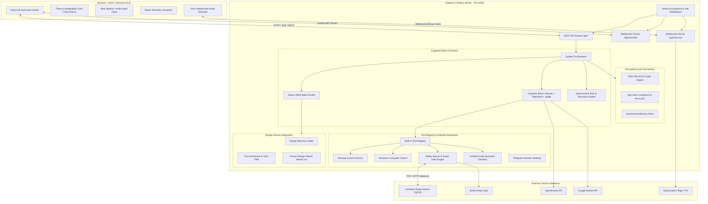
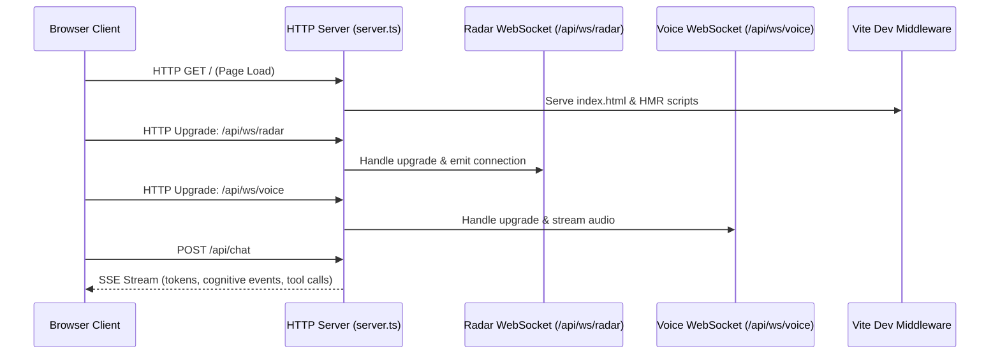
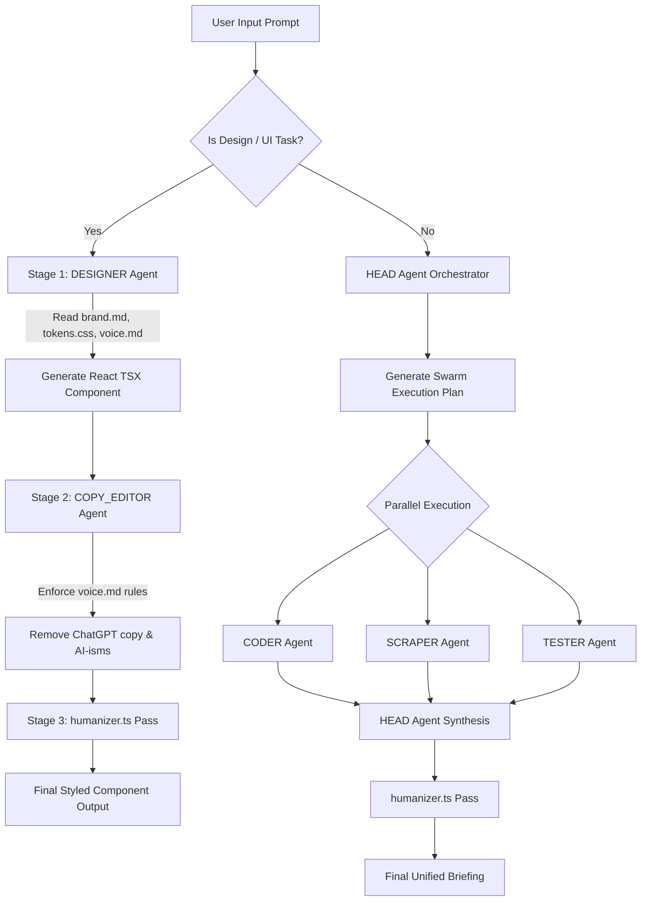
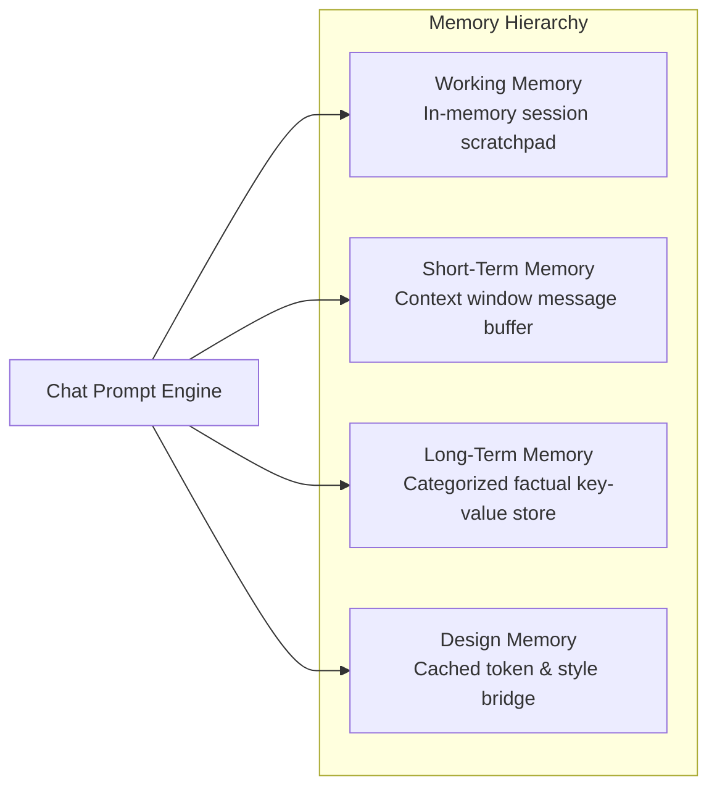

# System Architecture Document
## Super AI — Holographic Intelligence Command Platform

**Document Version**: 2.0  
**Status**: Active Production  
**Architecture Style**: Monorepo Full-Stack System (Express + React 19 + Three.js + WebSockets)  

---

## 1. High-Level Architecture Overview

Super AI is structured as a unified, high-performance monorepo application. The front-end leverages React 19 and Three.js to provide a cinematic, 60 FPS holographic HUD command interface. The backend is an Express 4 service running on Node.js that serves as an intelligent neuro-orchestrator, coordinating multi-model routing, multi-agent swarms, physical IoT sensors, persistent memory, and local desktop automation.



---

## 2. Frontend Architecture (React 19 + Three.js)

### 2.1 Component Tree & Hierarchy

The client application is organized into modular HUD components with clear boundaries:

```text
src/
├── main.tsx                      # React root rendering and global CSS imports
├── App.tsx                       # Main HUD state orchestration, hotkeys, layout grid
├── index.css                     # Tactical grid overlay, font stacks, scrollbars
├── types.ts                      # Shared TypeScript schemas, enums, interfaces
├── components/
│   ├── TopNavigation.tsx         # HUD header: AI state badge, live radar pill, volume, config launcher
│   ├── AICore3D.tsx              # Three.js holographic singularity core (emissive core, rings, particles)
│   ├── hologram/
│   │   ├── HologramScene.tsx     # Three.js 3D futuristic facial hologram container
│   │   ├── HologramFace.tsx      # Procedural 3D wireframe face geometry and vertex shaders
│   │   └── HologramMaterial.tsx  # Custom holographic scanline and fresnel shaders
│   ├── ActivityFeed.tsx          # Real-time message dialogue, markdown, cognitive trace inspection
│   ├── ChatInputArea.tsx         # Multimodal input, voice microphone trigger, state indicator
│   ├── SideTelemetryPanel.tsx    # Quantum flux meters, synapse frequencies, coherence graphs
│   ├── StateController.tsx       # Bottom HUD manual state override dock
│   ├── ToolAuthorizationModal.tsx# Security gate confirmation dialog for sensitive tool runs
│   ├── ViewMemoryModal.tsx       # Memory explorer and editor modal
│   └── control-panel/            # 16-section tabbed system settings suite
│       ├── ApiKeysSection.tsx    # Key management with AES-256 encryption status
│       ├── AutonomousTaskSection.tsx # Autonomous plan tracker and live step runner
│       ├── BrowserControlSection.tsx  # Puppeteer browser status and permission toggles
│       ├── CognitiveEngineSection.tsx # Planner, Specialist, Judge model assignment
│       ├── ComputerControlSection.tsx # Desktop allowlisted apps and folder configurations
│       ├── RecoveryObservabilitySection.tsx # Self-healing circuit breakers & telemetry
│       ├── VoiceSection.tsx      # Cloud TTS vs browser speech, dialect, rate, pitch
│       └── ...
└── hooks/
    ├── useVoiceInput.ts          # Web Speech API recognition hook
    ├── useVoiceStreaming.ts      # WebSocket-based real-time TTS audio streamer
    └── useRadarTelemetry.ts      # Bi-directional WebSocket radar sensor telemetry
```

### 2.2 3D Holographic Rendering Pipeline (`AICore3D.tsx`)

The 3D Singularity Core operates directly via standard Three.js within an imperative animation loop (`requestAnimationFrame`) to bypass React reconciliation overhead:

```text
WebGLRenderer (alpha: true, antialias: true, powerPreference: 'high-performance')
│
├── PerspectiveCamera (FOV: 45, Position: [0, 0, 18])
│
├── Core Group (Dynamic State Rotation & Parallax Tilting)
│   ├── Inner Sphere: Emissive MeshBasicMaterial (dynamic pulse scale 0.9–1.3x)
│   ├── Lattice Inner: Wireframe IcosahedronGeometry (subdivision 1)
│   ├── Lattice Outer: Translucent Wireframe IcosahedronGeometry (subdivision 2)
│   ├── 5 Differential Orbital Rings:
│   │   ├── Ring 1 (XY Plane): Speed +1.0x, Radius 4.2
│   │   ├── Ring 2 (YZ Plane): Speed -0.8x, Radius 5.1
│   │   ├── Ring 3 (XZ Plane): Speed +1.2x, Radius 6.0
│   │   ├── Ring 4 (Inclined 45°): Speed -1.5x, Radius 7.2
│   │   └── Ring 5 (Equatorial Outer): Speed +0.6x, Radius 8.5
│   └── Vector Particle Field:
│       ├── 3,200 reactive vector particles
│       ├── BufferGeometry with Float32Array positions & velocities
│       └── AdditiveBlending PointsMaterial with per-state color tinting
```

---

## 3. Backend Architecture (Express 4 + Node.js)

### 3.1 Server Lifecycle & Dual WebSocket Architecture (`server.ts`)

Super AI utilizes a single HTTP port (`3000`) for REST APIs, static client assets, Vite development middleware, and dual WebSocket protocols.



### 3.2 Cognitive Brain Architecture (`server/services/cognitive/`)

The Cognitive Brain manages the reasoning and validation lifecycle for multi-step queries:

1. **Planner (`planner.ts`)**: Deconstructs user intent into discrete steps, identifying required skills, tool dependencies, and risk levels.
2. **Specialist (`specialist.ts`)**: Dynamically resolves the optimal model role (`coding`, `reasoning`, `general`, `vision`) and executes the sub-task.
3. **Judge (`judge.ts`)**: Evaluates the specialist's output against the original requirement, issuing a verdict (`APPROVED`, `REVISED`, `SKIPPED`, `STANDBY`) with constructive critique.

### 3.3 Swarm Intelligence & Design Genius Architecture (`server/services/swarm/`)

The multi-agent swarm architecture operates in two distinct operational pathways:



### 3.4 Autonomous Task Engine & Recovery Observability (`server/services/task/`)

- **State Machine**: Cycles through `IDLE` -> `PLANNING` -> `WAITING_AUTHORIZATION` -> `EXECUTING` -> `VERIFYING` -> `COMPLETED`.
- **Self-Healing Observability Loop**:
  - Intercepts uncaught exceptions, tool timeouts, and HTTP rate limits (429).
  - Triggers the recovery circuit (`RECOVERING` state) to select alternative tools (e.g. falling back from headless browser DOM extraction to HTTP text scraping).
  - Maintains persistent telemetry in `TaskHistoryItem` for post-run analysis.

---

## 4. Storage & Cryptography Layer

### 4.1 AES-256-GCM Encryption Scheme (`server/crypto.ts`)

All sensitive assets (API keys, custom credentials, user preferences) are encrypted at rest using industry-standard authenticated encryption:

```text
Plaintext Key 
      │
      ▼
Derive 256-bit Key via scrypt (using APP_SECRET_KEY)
      │
      ▼
Generate fresh 12-byte cryptographically secure random IV
      │
      ▼
Cipher: AES-256-GCM (Plaintext + Key + IV)
      │
      ├──> Ciphertext (Hex)
      ├──> Auth Tag (16 bytes, Hex)
      └──> IV (12 bytes, Hex)
      │
      ▼
Stored Record: `${iv}:${authTag}:${ciphertext}`
```

### 4.2 Hierarchical Memory Engine (`server/services/memory/`)



- **Working Memory**: Dynamic scratchpad tracking active multi-step goals. Cleared at end of session.
- **Short-Term Memory**: Bounded message queue managing conversation turns with automatic token compression.
- **Long-Term Memory**: Structured persistent store indexed by category (`user_preference`, `project_fact`, `instruction`, `general`) with importance scoring (1-10) and tags.
- **Design Memory**: In-memory singleton providing direct prompt injection of `brand.md`, `tokens.css`, and `voice.md` without file I/O overhead.

---

## 5. Tool Registry, Security & Authorization Model

### 5.1 Permission & Risk Matrix

| Risk Level | Default Action | Examples | Authorization Requirement |
|---|---|---|---|
| `NONE` | `ALLOW` | `current_date`, `current_time` | Automatic execution |
| `LOW` | `ALLOW` | `calculator`, `read_file` (sandboxed) | Automatic execution |
| `MEDIUM` | `ASK` | `web_search`, `browserReadPage`, `wifiScanner` | Confirmation if permission is `ASK` |
| `HIGH` | `ASK` | `createFileTool`, `openApplication`, `smartGate` | Explicit user confirmation modal |
| `CRITICAL` | `DENY` / `ASK` | `executeCode` (terminal), `repoModifier`, `deleteFiles` | Strict operator approval with parameter inspection |

### 5.2 Two-Phase Tool Execution Flow

1. **Phase 1 (Inspection & Gate Check)**: The Cognitive Brain emits a tool invocation request. The permission engine evaluates the user's configured permission level for that specific capability.
2. **Phase 2 (Execution or Interception)**:
   - If `ALLOW`: Tool executes immediately and streams result to the brain.
   - If `ASK`: Execution suspends. System transitions to `AUTHORIZATION` state. Client renders `ToolAuthorizationModal` with parameter breakdown.
   - If `DENY`: Invocation is aborted, and a security cancellation event is logged to the activity feed.

---

## 6. Physical Hardware & Desktop Integration

### 6.1 mmWave Radar Sensor Telemetry (`server/services/iot/radarSensor.ts`)

- **Protocol**: Raw TCP / HTTP webhook data emitted from an ESP32 mmWave radar sensor is ingested via `/api/iot/radar/event`.
- **Event Bus**: Ingested payloads are broadcast across the `RadarEventBus` to active `/api/ws/radar` WebSocket subscribers.
- **Autonomous Presence Trigger**: When target presence transitions from `false` to `true`, the system wakes from sleep, shifts holographic core color to Amber/Cyan, and can emit an audio greeting.

### 6.2 Puppeteer Browser Automation (`server/services/browser/`)

- Operates a dedicated, sandboxed Chromium instance.
- Explicit security guardrails:
  - Password and credential autofill are hard-blocked.
  - Arbitrary JavaScript evaluation on untrusted origins is disabled.
  - Payment gateways and checkout flows are blocked.
  - Downloads of executable files (`.exe`, `.bat`, `.ps1`) are intercepted and killed.

---

## 7. System Directory Layout

```text
Super-AI/
├── public/                    # Static assets, 3D GLB models, favicon
├── server/                    # Express backend architecture
│   ├── crypto.ts              # AES-256-GCM authenticated encryption engine
│   ├── storage.ts             # App store configuration, audit logs, key store
│   ├── design_genius/         # Frozen UI design system & voice rules
│   │   ├── brand.md           # Brand visual guidelines, spacing, typography
│   │   ├── voice.md           # Personality Bible, banned words, response rhythm
│   │   ├── tokens.css         # Frozen CSS custom properties and color variables
│   │   └── humanizer.ts       # Text cleaning middleware stripping AI-isms
│   ├── memory/                # Design memory module
│   ├── routes/                # Express REST endpoint modules
│   │   ├── apiKeys.ts         # Encrypted key CRUD routes
│   │   ├── chat.ts            # Chat SSE streaming endpoint
│   │   ├── config.ts          # System settings persistence
│   │   ├── iot.ts             # Radar webhooks & smart gate endpoints
│   │   ├── memory.ts          # Memory query and deletion endpoints
│   │   ├── sandbox.ts         # Code execution sandbox endpoints
│   │   └── tasks.ts           # Autonomous task plan & step endpoints
│   └── services/              # Core business logic services
│       ├── browser/           # Puppeteer automation & URL validation
│       ├── cognitive/         # Planner, Specialist, Judge, Cognitive Brain
│       ├── iot/               # Radar sensor event bus & Smart Gate driver
│       ├── memory/            # Working, short-term, and long-term memory services
│       ├── swarm/             # Multi-agent swarm router & specialist agents
│       ├── task/              # Autonomous task engine & recovery observer
│       ├── tools/             # Built-in tool registry and implementations
│       ├── voice/             # Real-time WebSocket streaming audio server
│       ├── computerControl.ts # Windows application launching & keyboard control
│       ├── openrouter.ts      # OpenRouter multi-model API bridge
│       └── telegramBot.ts     # Remote Telegram gateway
├── src/                       # React 19 Frontend application
│   ├── components/            # UI HUD, 3D Canvas, Control Panel tabs
│   ├── hooks/                 # WebSocket and Audio Stream hooks
│   ├── services/              # Client-side API fetch bridge
│   ├── utils/                 # Web Speech API helpers
│   ├── App.tsx                # Main tactical HUD container
│   ├── index.css              # Global styles, scanlines, animations
│   ├── main.tsx               # Client entrypoint
│   └── types.ts               # Shared TypeScript types and contracts
├── server.ts                  # Server entrypoint & Vite middleware setup
├── vite.config.ts             # Vite bundling and Tailwind plugin setup
├── tsconfig.json              # Strict TypeScript configuration
└── package.json               # Project manifest
```
