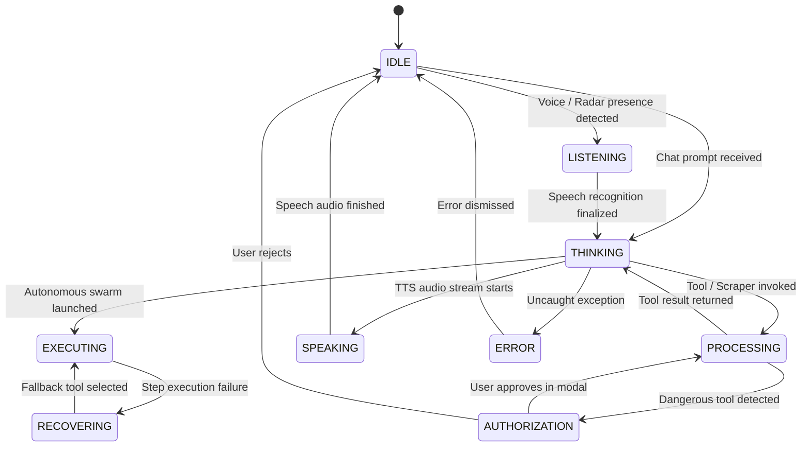

# Agent Memory & Project Context Log
## Super AI — Technical Decision Records & Persistent Agent Brain

**Document Version**: 2.0  
**Purpose**: Persistent working memory for AI agents, architectural rationale, lessons learned, and system trivia.  
**Last Updated**: 2026-09-22  

---

## 1. Project Identity & Operational Environment

| Attribute | Value | Context & Operational Notes |
|---|---|---|
| **Project Name** | **Super AI** | Futuristic holographic personal intelligence command center. |
| **Creator / Operator**| **Mohit Kumar** | Primary user; communications should be direct, confident, and peer-to-peer. |
| **Monorepo Root** | `d:\Mohit\Web Dovelopment\Super AI\Super-AI\` | Workspace directory for all frontend, server, and IoT code. |
| **Primary Tech Stack**| React 19, TypeScript 5.8, Three.js, Express 4, Tailwind v4 | High-performance SPA with Node.js runtime. |
| **Development Server**| `npm run dev` | Runs `tsx server.ts` with Vite middleware mode on port `3000`. |
| **Production Build** | `npm run build` | Builds Vite assets to `dist/` and bundles server via `esbuild` to `dist/server.cjs`. |
| **Port Binding** | `3000` | Shared by REST API, static assets, Vite HMR, and dual WebSockets. |

---

## 2. Architectural Decision Records (ADRs)

### ADR-001: Express 4 + Vite Middleware vs. Next.js / Remix
- **Decision**: Use a custom Express 4 backend with Vite in middleware mode during development and static serving in production.
- **Rationale**:
  - Super AI requires long-lived stateful processes: Puppeteer browser instances, continuous WebSocket streams (`/api/ws/radar`, `/api/ws/voice`), and background task observers.
  - Serverless-centric meta-frameworks (Next.js, Remix) make persistent WebSocket upgrade routing and persistent child process management complex and brittle.
  - Express gives complete, low-level control over the Node.js HTTP server lifecycle, TCP sockets, and sandboxed child execution.

### ADR-002: Direct Three.js WebGL Canvas vs. React Three Fiber (R3F)
- **Decision**: Implement `AICore3D.tsx` and `HologramScene.tsx` using native Three.js within an imperative `requestAnimationFrame` loop.
- **Rationale**:
  - The 3D singularity core renders 3,200 vector particles, 5 orbital rings, and dual icosahedrons rotating at different harmonic frequencies at 60 FPS.
  - Declarative reconcilers like R3F introduce React fiber overhead and frequent garbage collection cycles under high particle volume.
  - Native Three.js completely isolates the 60 FPS animation loop from React component re-renders.

### ADR-003: AES-256-GCM Encrypted Local Store vs. External Database
- **Decision**: Store all sensitive keys, system configuration, memory items, and audit logs locally in `.data/` encrypted with AES-256-GCM.
- **Rationale**:
  - Super AI is a local-first command platform. Requiring an external database (PostgreSQL, MongoDB) would introduce unnecessary setup friction.
  - Symmetric authenticated encryption (`crypto.ts`) ensures that even if the repository or storage files are inspected, API keys cannot be extracted without the master secret.
  - Each write operation derives a 256-bit key via `scrypt` and generates a cryptographically fresh 12-byte initialization vector (IV).

### ADR-004: Three-Stage Design Genius Swarm Pipeline
- **Decision**: Route all UI and frontend tasks through a dedicated 3-stage pipeline: `DESIGNER` -> `COPY_EDITOR` -> `humanizer.ts`.
- **Rationale**:
  - Standard LLMs generate generic, non-authoritative components with inconsistent color palettes and corporate placeholder copy.
  - **Stage 1 (`DESIGNER`)** forces the model to read `tokens.css` and `brand.md`, ensuring 100% token consistency.
  - **Stage 2 (`COPY_EDITOR`)** strips out generic "AI-isms" and applies the rules of `voice.md`.
  - **Stage 3 (`humanizer`)** performs an algorithmic regex pass removing banned phrases ("seamless", "robust", "dive in") from user-facing text.

### ADR-005: Shared HTTP Server with Dual WebSocket Protocols
- **Decision**: Run both `/api/ws/radar` and `/api/ws/voice` on the same HTTP server (`PORT 3000`) by attaching specific pathname handlers to the `httpServer.on('upgrade')` event.
- **Rationale**:
  - Avoids opening multiple firewall ports.
  - Simplifies reverse proxy configuration (e.g. Nginx or Cloudflare Tunnel) when accessing the command console remotely.

---

## 3. Known Gotchas, Traps & Lessons Learned

### 3.1 WebSocket Upgrade Collision Trap
- **Trap**: When multiple WebSocket servers or upgrade listeners are registered on the same HTTP server, calling `socket.destroy()` unconditionally in an `else` branch will prematurely terminate valid handshakes meant for the other handler.
- **Solution**: Always check all supported pathnames before destroying the socket.
  ```ts
  httpServer.on('upgrade', (request, socket, head) => {
    const url = new URL(request.url ?? '/', `http://localhost:${PORT}`);
    if (url.pathname === '/api/ws/radar') {
      radarWss.handleUpgrade(request, socket, head, (ws) => {
        radarWss.emit('connection', ws, request);
      });
    } else if (url.pathname !== '/api/ws/voice') {
      // Safe to destroy: neither radar nor voice matched
      socket.destroy();
    }
  });
  ```

### 3.2 Tailwind CSS v4 Vite Setup
- **Trap**: Tailwind v4 no longer uses `tailwind.config.js`. Attempting to load v3 configuration files causes silent styling failures or build errors.
- **Solution**: Use `@tailwindcss/vite` in `vite.config.ts`, and import `@import "tailwindcss";` directly in `src/index.css`. All custom themes and design tokens are declared as CSS variables in `tokens.css`.

### 3.3 Three.js Canvas Disposal on Hot Module Reload (HMR)
- **Trap**: During Vite HMR, React re-mounts `AICore3D.tsx`. Failing to cancel the animation frame or dispose of WebGL buffers leads to memory leaks and WebGL context loss warnings (`CONTEXT_LOST_WEBGL`).
- **Solution**: The `useEffect` cleanup hook must explicitly call `cancelAnimationFrame(reqId)`, loop through all geometries and materials to call `.dispose()`, and remove window resize listeners.

### 3.4 Code Block Preservation During Humanizing
- **Trap**: Applying `humanize()` regex replacements across an entire LLM response can accidentally corrupt code blocks (e.g. replacing variable names or comments matching banned words).
- **Solution**: `humanizer.ts` isolates fenced markdown code blocks (` ```...``` `) before applying regex filters, re-injecting them uncorrupted after processing.

### 3.5 Puppeteer Headless Quirks on Windows
- **Trap**: On Windows, headless Chromium instances can occasionally become zombie processes in Task Manager if unhandled exceptions crash the parent Node process.
- **Solution**: Always register `process.on('SIGINT')` and `process.on('SIGTERM')` cleanup hooks to iterate over active Puppeteer browser instances and call `await browser.close()`.

---

## 4. AI State Machine Reference



---

## 5. Tool Call Protocol Specification

When tools are invoked by the Cognitive Brain:
1. **Payload Schema**:
   ```json
   {
     "tool": "calculator",
     "arguments": { "expression": "42 * 1024" },
     "toolCallId": "call_123456"
   }
   ```
2. **Execution Response**:
   ```json
   {
     "toolCallId": "call_123456",
     "tool": "calculator",
     "success": true,
     "result": "43008",
     "executionTimeMs": 12
   }
   ```
3. **Audit Log Persistence**: Automatically appended to `ToolActivityLog` and visible within the Tactical HUD Activity Feed.
